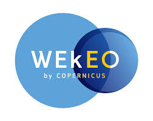
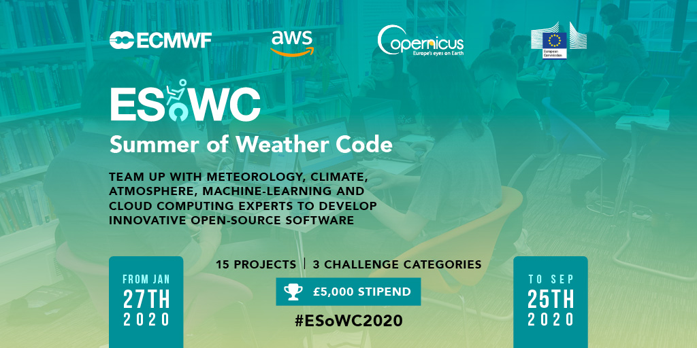

# ECMWF Summer of Weather Code 2020

ECMWF Summer of Weather Code is a collaborative programme where each summer several developer teams work on innovative weather- and climate-related open-source software. ESoWC is organised by the [European Centre for Medium-Range Weather Forecasts (ECMWF)](www.ecmwf.int) and supported by [Copernicus](climate.copernicus.eu). 

Generous cloud computing ressources are provided by: 
* [Amazon Web Services](https://aws.amazon.com/) 
</img>  

 
* the Copernicus Data and Information Access Service (DIAS) [WEkEO](https://www.wekeo.eu/) powered by [CloudFerro](https://cloudferro.com/en/) 
</img></img> 

 

</img>

 

## ESoWC 2020 Projects
Congratulations to the 11 teams that have been selected to be part of ECMWF Summer of Weather Code 2020:

| Project title | Team | Mentors | Supported by |
| ---------- | --------------- | -------------- |---------------------|
| [Elefridge.jl](https://github.com/esowc/Elefridge.jl) | [Milan Kloewer](https://github.com/milankl) | - [Miha Razinger](https://github.com/miha-at-ecmwf)   - [Juan-Jose Dominguez](https://github.com/juanjodd) | [WEkEO](https://www.wekeo.eu/) powered by [CloudFerro](https://cloudferro.com/en/) |
| [Forecasting Wildfire Danger with Deep Learning](https://github.com/esowc/wildfire-forecasting) | - [Roshni Biswas]()   - [Anurag Saha Roy]()   - [Tejasvi S Tomar]() | - [Claudia Vitolo]()   - [Tianran Zhiang]() | [WEkEO](https://www.wekeo.eu/) powered by [CloudFerro](https://cloudferro.com/en/) |
| [ECMWF Conversational Virtual Assistant](https://github.com/esowc/ECMWF-Conversational-Virtual-Assistant) | - [Frank Lieber](https://github.com/liefra)   - [Michael Kuhn]() | - Anna Ghelli   - Helen Setchell   - Michela Gusti | [AWS](https://aws.amazon.com/) |
| [HPC Performance Profiling Tool](https://github.com/esowc/HPC-performance-profiling-tool) | - [Tiberiu Lepadatu]() | - Olivier Marsden   - Michael Lange   - Clara Brune | [AWS](https://aws.amazon.com/) |
| [Air Quality Observation Classification 1](https://github.com/esowc/air-quality-observation-classification) | - [Gordan Rates]() |- [Miha Razinger](https://github.com/miha-at-ecmwf)   - [Johannes Flemming](https://github.com/juanjodd) | [AWS](https://aws.amazon.com/) |
| [Air Quality Observation Classification 2]() | - [Mohit Anand]()   - [Kumar Shridar]() |- [Miha Razinger](https://github.com/miha-at-ecmwf)   - [Johannes Flemming]() | [AWS](https://aws.amazon.com/) |
| [Exploring of machine/deep learning techniques to detect and track tropical cyclines]() | - [Ashwin Samudre](https://github.com/kiryteo) | - [Linus Magnusson]()   - [Pedro Maciel]() | [AWS](https://aws.amazon.com/) |
| [WeatherWise - An innovative 11km weather prediction model for Europe based on Meso-NH]() | - [Florian Cochard]()   - [Quentin Rodier]() | - [Jordan Rice]()   - [Julia Wagemann]() | [AWS](https://aws.amazon.com/) |
| [Applying AI capabilities to address Operations challenges in ECMWF Products Team]() | - [Adithya Niranjan]()   - [Aditya Ahuja]() | - [Matthew Manoussakis]()   - [Peter Dueben]() | [AWS](https://aws.amazon.com/) |
| [Creating Jupyter-based OpenIFS training material]() | - [Ayush Prasad]() | - [Olivier Marsden]()   - [Michael Lange]()   - [Adrien Oyono] | [AWS](https://aws.amazon.com/) |
| [UNSEEN-Open](https://github.com/esowc/UNSEEN-open) | - [Timo Kelder]() | - [Julia Wagemann]()   - [Christel Prudhomme]() | |

## How it works

### 1. Application period: 27 Jan - 22 Apr 2020
Browse through the [ESoWC 2020 challenges](https://github.com/esowc/challenges_2020/issues) or develop your own project idea. You have time until 22 April 2020 to submit your proposal.   Take advantage of GitHub, ask questions and tailor your submission, together with the mentors of the challenge.

##### Some tips on what makes a good proposal:
- it is **well structured and precise**
- the solution proposed is **technically feasible within 4 months**
- it contains a **clear timeline with milestones and deliverables defined**

### 2. Announcement of selected proposals: 1 May 2020
The final ESoWC 2020 project teams will be announced on 1 May 2020. Follow ESoWC on [Twitter](https://twitter.com/esowc_ecmwf) or visit the [ESoWC website](https://esowc.ecmwf.int) and get all updates.

### 3. Coding period: 4 May  - 31 Aug 2020
The 4-month long coding period starts 4 May 2020 and last until 31 August 2020. During this time, the selected teams team up with experienced mentors and experts in weather, climate, machine-learning and cloud-computing.   Follow the progress of the projects here on Github.

### 4. Final ESoWC day @ECMWF: 25 September 2020
The ESoWC day @ECMWF is the final day of the programme. All project teams are invited to come to ECMWF’s headquarter to present their project and results and to meet their mentors. The presentations will be live-streamed.

 

## Important links
* [ESoWC Frequently Asked Questions](http://esowc.ecmwf.int/FAQ)
* [Submit your application](https://esowc.commpla.com/form/application-form)

* [ESoWC Terms & Conditions](http://esowc.ecmwf.int/terms-and-conditions)
* Follow ESoWC on [Twitter](https://twitter.com/esowc_ecmwf), [LinkedIn](https://www.linkedin.com/showcase/ecmwf-summer-of-weather-code/) and [YouTube](https://www.youtube.com/channel/UCWLn6evyZ6tTktvUSTE1Xow)
